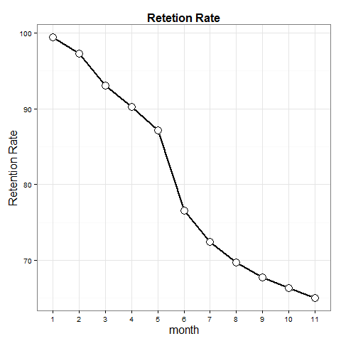

```{r,include=FALSE}
library(ggplot2)
library(scales)
library(dplyr)
library(tidyr)
```

```{r,include=FALSE}
educational <- read.csv("C:/Users/Cindy/Desktop/class/customer/week 11 Interpreting interactionsDiscrete Time Survival Analysis/educational service long.csv")

```


```{r}
##|---------------------
##|Question 1         |
##|---------------------

educational <- educational %>% rename(month = T)

mydata <- educational %>%
  filter(cancelnow == 0) %>%
  group_by(month) %>%
  summarise( retention = length(cancelnow)) %>%
  data.frame() %>%
  mutate(customer_number = 4721,
         retention_rate = round((retention/customer_number)*100,2)) %>%
  data.frame()


ggplot(mydata, aes(x = as.factor(month), y = retention_rate)) + 
  geom_line(size = 1, aes(group = "month")) +
  geom_point(shape=21, size=5, fill="white") +
  theme_bw() +
  ggtitle("Retetion Rate") + 
  theme(plot.title = element_text(lineheight=.8, face="bold", size = 16)) +
  xlab('month') +
  ylab('Retention Rate') +
  theme(axis.title.x = element_text(size=16)) +
  theme(axis.title.y = element_text(size=16))

```

Figure



